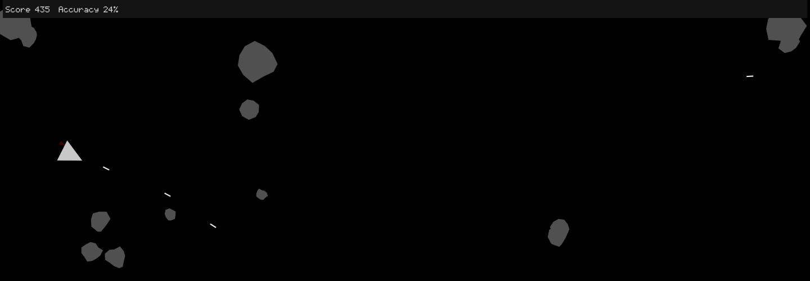

### After watching Dan Shiffman's Coding Challenge re-creating Asteroids using p5.js, I was inspired to create my own version of this classic arcade game in the browser.

You can give the game a whirl yourself [here.](/p5-asteroids/)

