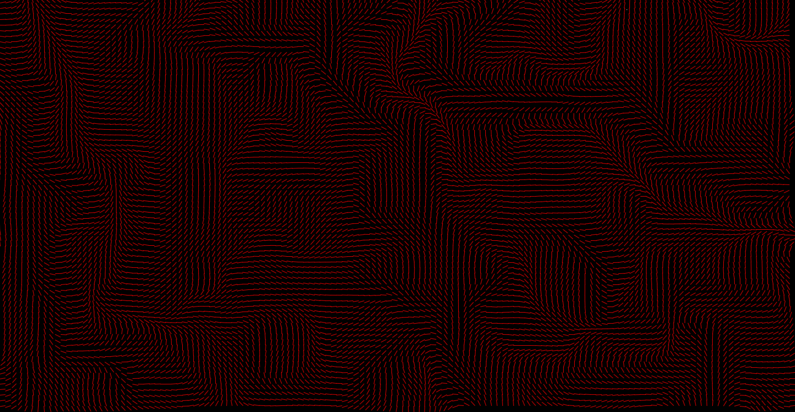

## Another project based on Dan Shiffman's Coding Challenges!

Try it out yourself [here.](/p5-perlin-noise/)

### Background

It is 1983. Your name is Ken Perlin. You're frustrated with the blocky nature of computer graphics of the day. You invent an algorithm to make things better.

[Perlin Noise](https://en.wikipedia.org/wiki/Perlin_noise) is the result. It's...

> a technique used to produce natural appearing textures on computer generated surfaces for motion picture visual effects.

In essence, it's a way to generate "similar" random numbers, and `p5.js` uses Perlin Noise for its [noise](https://p5js.org/reference/#/p5/noise) function.

> Perlin noise is a random sequence generator producing a more natural ordered, harmonic succession of numbers compared to the standard random() function.

In this project, we use it to create a 2D field of vectors, each pointing in a similar, but different, direction:

We then sprinkle several thousand particles over the top, and have their velocities affected by the vectors. Depending on how we draw them, we can generate some pretty cool stuff.

Try it out yourself [here.](/p5-perlin-noise/)
